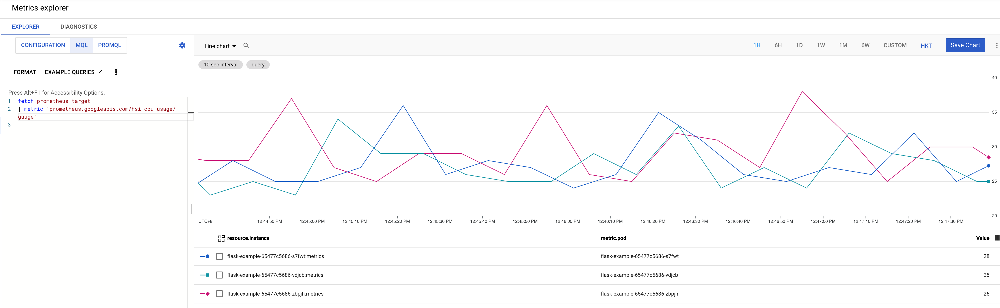

### Google Cloud Managed Service for Prometheus (GMP) with custom metrics

This repository contains sample application and PodMonitoring configuration to be used with (GMP). The sample application 
exports custom metrics and expose via metrics endpoints. Prometheus PodMonitoring Scrape interval could be adjusted in 
the PodMonitoring object.

### Getting Started
This repository include the following folders
- [gmp](gmp) - Kubernetes deployment script
- [src](src) - Python Flask sample application to customize metrics

To test the scripts, you may follow the following steps
1. Launch a GKE cluster with managed Prometheus (Refer to GKE Cluster Creation section)
2. Containerize Python Flask sample application and deploy to GRC (Refer to App Building section)
3. Deploy `PodMonitoring` resource (Refer to PodMonitoring Resource Section)
4. Optional step to load test the pod (Refer to Load Test section)
5. Visualize Custom Metrics result (Refer to Visualization section)

### GKE Cluster creation

Create a new GKE cluster with managed Prometheus enabled

```shell
gcloud beta container clusters create CLUSTER_NAME --zone ZONE --enable-managed-prometheus
```


Create Name Space

```shell
kubectl create ns gmp-test
```


### App Building

The following steps shall perform in [src](src) folder. 

Build Docker Container
```shell
docker build -t flask-demo:0.1 .
```

Tag Docker container, remember to replace PROJECT_ID to your project id
```shell
docker tag flask-demo:0.10 gcr.io/PROJECT_ID/flask-demo:0.1
```

Push docker container to GCR under your project, remember to replace PROJECT_ID to your project id
```shell
docker push gcr.io/PROJECT_ID/flask-demo:0.1
```

### PodMonitoring Resource Section

The following steps shall perform in [gmp](gmp) folder. 

Deploy flask demo app and deploy PodMonitoring
```shell
kubectl -n gmp-test apply -f flask-demo.yaml
kubectl -n gmp-test apply -f flask-monitoring.yaml
```

To troubleshoot the `flask-example` pod locally
```shell
kubectl port-forward POD_NAME 8080 -n gmp-test
```

To delete the pod and Pod monitoring
```shell
kubectl -n gmp-test delete -f flask-demo.yaml
kubectl -n gmp-test delete -f flask-monitoring.yaml
```

### Load test

Use busy box to generate the load
```shell
kubectl -n gmp-test run -i --tty load-generator --rm --image=busybox:1.28 --restart=Never -- /bin/sh -c "while sleep 0.01; do wget -q -O- http://flask-sample; done"
```

### Visualization

On the Monitoring page -> Metrics explorer -> MQL, you can use the following queries to retrieve custom metrics and display
result in charts. 

```shell
fetch prometheus_target
| metric 'prometheus.googleapis.com/hsi_cpu_usage/gauge'
```

The following screenshot shows a chart that displays the up metric:




References

1. [How to set up Prometheus monitoring for your services](https://www.youtube.com/watch?v=qyfOE_78nT0)
2. [Promethus Python Sample](https://github.com/GoogleCloudPlatform/python-docs-samples/blob/3df11db721a99ffaf19d3d9dc8cb4c838f725b28/monitoring/prometheus/main.py)
3. [Get started with managed collection](https://cloud.google.com/stackdriver/docs/managed-prometheus/setup-managed)
4. [Prometheus API](https://github.com/GoogleCloudPlatform/prometheus-engine/blob/v0.4.3-gke.0/doc/api.md#podmonitoringspec)
5. [Prometheus Python Client](https://github.com/prometheus/client_python)
